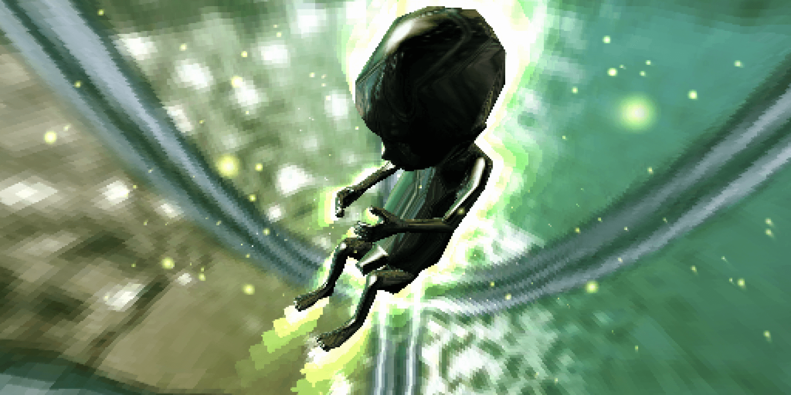

# forward by Komplex (preservation)
Forward Java demo, rebuilt from the bytecode, adapted to a more recent JDK and packaged as a standalone binary. Part of my PhD project about demoscene preservation.

## Original authors:

- saviour, jmagic, anis - _code_
- carebear, jugi - _music_
- jugi - _graphics_
- reward - _komplex 3D klunssi_



## What Has Been Modernized

- removed the `Applet` dependency in favor of an AWT desktop host
- replaced the old `IE3/IE4` / `sun.audio` audio backends with `Java Sound`
- fixed decompiled classes that still contained `GOTO` artifacts
- disabled the intermediate switch to a full-screen window so the whole demo stays in the same desktop window
- retimed the `phorward.gif` scroll in `domina` and `uppol` to a virtual `50 Hz` cadence to avoid speeding up on modern machines
- retimed the frame-driven parts of `mute95` from scene time to limit intro overexposure without breaking warp fluidity
- retimed the frame-driven animations in `watercube` to a virtual `50 Hz` cadence so the center rotation, ripple, and `rok` damping stay aligned with the original binary
- restored the original affine rasterizer for Java materials `3` / `259` to remain source-faithful in `saari`
- locked AWT text rendering to an explicit monospace font with antialiasing disabled so text screens stay consistent between the source launcher and the `jpackage` build

## Prerequisites

- a JDK available in `PATH`

## Launching

From the repository root:

```bat
run_forward_desktop.bat
```

Without interactive launch arguments, the desktop launcher now opens a small startup GUI where you can choose:

- `Windowed`
- `Fullscreen`
- a display resolution loaded from `forward-launcher.ini`
- `1x1 pixel mode`

If `forward-launcher.ini` is missing, the launcher falls back to two built-in choices:

- `Native 512x256`
- `X2 1024x512`

`Fullscreen` keeps a black background across the entire screen and centers the demo at the selected size.
`1x1 pixel mode` matches the original Java binary flag `1x1 1`. It is now enabled by default in the desktop port.

Historical options are still supported:

```bat
run_forward_desktop.bat nosound 1
run_forward_desktop.bat 1x1 1
run_forward_desktop.bat 1x1 0
run_forward_desktop.bat nosound 1 1x1 1
```

Additional desktop options:

```bat
run_forward_desktop.bat launcher 0 displaymode windowed displayscale 2
run_forward_desktop.bat launcher 0 displaymode fullscreen displayscale 1
```

Parameters:

- `launcher 0`: skip the startup GUI
- `displaymode windowed|fullscreen`: force the display mode
- `displayscale 1|2`: change only the final on-screen presentation size
- `1x1 1|0`: force `1x1` mode on or off

The historical `1x1 1` flag still controls the internal rendering mode. `1x1 0` forces the older reduced mode. `displayscale` affects only on-screen presentation.

The script compiles `java-desktop/src/main/java` into `java-desktop/build/classes`, then launches `ForwardDesktopLauncher` using `original/forward` as the working directory so the original assets can be reused.

`forward-launcher.ini` is read from the repository root in the source workflow and can be edited to change the resolution list shown by the startup GUI.

## Win64 Packaging

A `jpackage` workflow is now available to produce a standalone Windows build with an embedded Java runtime:

```bat
package_forward_desktop.bat
```

Default output:

```text
java-desktop\dist\jpackage\app-image\forward-komplex\forward-komplex.exe
```

`forward-komplex.exe` does not require a JDK to be installed on the target machine.
The packaging script also converts `java-desktop/app-icon.png` into a standard Windows `.ico` and embeds it into the packaged launcher.
It also copies `original/forward/README.TXT` and `original/forward/version.txt` next to `forward-komplex.exe`.

The packaged build uses the same launcher GUI as the source build, with the same `displaymode`, `displayscale`, and `launcher 0` options.
The packaging script also copies `forward-launcher.ini` next to `forward-komplex.exe` so the packaged resolution list stays editable after distribution.

Optional Windows installer:

```bat
package_forward_desktop.bat exe
```

Installer generation requires WiX in `PATH`. The plain `app-image` only depends on the JDK.

The detailed workflow is documented in:

- `documentation/forward-jpackage-workflow.md`

## Reference Capture

### Generate documentation figures

The Python scripts in `documentation/tools/` assemble the source captures in
`img/figures/` and write their PNGs to `img/figures/output/`.
They require Python 3.10 or newer and Pillow. From the repository root:

```sh
python -m pip install -r documentation/tools/requirements.txt
python documentation/tools/make_ground_truth_mosaic.py
python documentation/tools/make_portage_bands.py
python documentation/tools/make_java_reconstruction_bands.py
python documentation/tools/make_cpp_port_bands.py
```

Each script can be run independently and replaces only its own output:

| Script | Output in `img/figures/output/` |
| --- | --- |
| `make_ground_truth_mosaic.py` | `ground-truth-mosaic-4x3.png` |
| `make_portage_bands.py` | `ground-truth-vs-naive-port-bands.png` |
| `make_java_reconstruction_bands.py` | `ground-truth-vs-java-reconstruction-bands.png` |
| `make_cpp_port_bands.py` | `ground-truth-vs-cpp-port-bands.png` |

Paths are resolved relative to the scripts, so they also work when launched
from another directory. Use `--figures-dir` and `--output` to override the
source directory and output file, or `--help` for all options.

The scripts were moved from the thesis repository's
`obsidian/these/40_articles/JCDL/` directory. Missing naive-port and Java
captures were copied from its `acmart-primary/figures/` directory. Java
pairing uses the original short filenames, starting at `java_img_007694.png`;
the older capture filenames containing timestamps sort before this starting
point and are not used. The C++ comparison skips the two Maku references
without corresponding C++ captures, as in the original script.

Roboto Regular and Bold are included in `documentation/tools/fonts/` with their license;
no system font installation is needed. The regenerated figures retain the
original dimensions and image content, with slight differences in text
rendering compared with the original macOS exports.

#### Reduced comparisons for slides

Three additional scripts generate three pairs (6 images), compared with ten
pairs in the full grids. Each output keeps the original 2816 x 1124 canvas
and its exact height/width ratio. Three references occupy the top image row,
with their three counterparts directly below, in the same scene order across
all three outputs. Scene names overlay the bottom-right corner of each
capture; the reference/port labels appear once per row, overlaying the
bottom-left corner of its first capture. Scene names use a larger 68-pixel
font. All labels are white with a black outline; space is reserved between
the two labels on the first capture to prevent overlap.
The grid fills the canvas except for 8-pixel gutters. Each tile measures
933 or 934 x 558 pixels. To fill these cells without stretching, the images
are center-cropped horizontally (about 16% of the original width is removed,
split equally between both sides). Both captures in each pair use the same
crop. Watercube and Feta are omitted from this slide selection.

```sh
python documentation/tools/make_portage_bands_slides.py
python documentation/tools/make_java_reconstruction_bands_slides.py
python documentation/tools/make_cpp_port_bands_slides.py
```

The corresponding outputs in `img/figures/output/` are:

- `reference-vs-naive-port-bands-slides.png`
- `reference-vs-java-reconstruction-bands-slides.png`
- `reference-vs-cpp-port-bands-slides.png`

The shared selection in `documentation/tools/slide_comparisons.py` was made
by inspecting visible differences in the naive-port grid, not by scoring
the Java or final C++ results:

| Reference | Visible difference in the naive port |
| --- | --- |
| `28_saari` | Missing island and different object appearance |
| `39_kukot` | Loss of metallic shading on the foreground figure |
| `48_maku` | White frame instead of the canyon |

Java uses these exact references and its existing corresponding captures.
C++ uses the same references except for Maku: `50_maku` paired with
`cpp_img_011202.png` is the nearby view already used in the full C++ grid;
there is no C++ counterpart for `48_maku`.

The visible row label is now `reference` in both the full and reduced grids.
The full grids retain their existing filenames and ten-pair selection.
The slide scripts also accept `--figures-dir`, `--output`, `--font`,
`--background`, and `--scale` (a positive integer resolution multiplier that
preserves the exact canvas ratio).

### Capture the running demo

The desktop build can now capture itself to PNG through `key value` parameters.

Example:

```bat
run_forward_desktop.bat capture documentation\reference-capture\java captureintervalms 2000 capturelimit 60 captureexit 1
```

Capture mode automatically skips the startup GUI. Captures remain in native `512x256` resolution even if interactive display was selected in `x2`.

Ready-to-use wrappers:

```bat
capture_forward_demo.bat
capture_reference_video.bat
```

Outputs:

- `documentation/reference-capture/java/manifest.csv`
- `documentation/reference-capture/java/frames/*.png`

The full Java capture + video extraction + comparison workflow is documented in:

- `documentation/forward-reference-capture-workflow.md`
