# Forward Global Script Timeline (from decompiled `forward.java`)

This is extracted from `reverse/cfr_single/forward.java`, from the `kkAmajA` command array executed by `forward.KamAjak()`.

Time markers use script-hex units:
- `_xxxx` sets absolute script time (hex).
- `__xx` adds relative delta (hex) to previous script time.
- A later `_000` starts a new phase in command order (time resets, script order does not).

## Scene Registry

| Script Name | Decompiled Class | Type |
|---|---|---|
| `mute95` | `kmjjkmk` | mmjjmma scene |
| `domina` | `kajakka` | majjkka routine |
| `saari` | `maajmka` | mmjjmma scene |
| `kukot` | `kajjkka` | mmjjmma scene |
| `maku` | `kmjjmka` | mmjjmma scene |
| `watercube` | `kmajmka` | mmjjmma scene |
| `feta` | `kmaamka` | mmjjmma scene |
| `uppol` | `mmaakmk` | majjkka routine |

## Scene Spans (in script order)

| Scene | Start | End |
|---|---|---|
| `mute95` | `P0 0x0000` | `P0 0x0D00` |
| `domina` | `P0 0x0D00` | `P1 0x0000` |
| `saari` | `P1 0x0000` | `P1 0x0700` |
| `kukot` | `P1 0x0700` | `P1 0x0D00` |
| `maku` | `P1 0x0D00` | `P1 0x1000` |
| `watercube` | `P1 0x1000` | `P1 0x1300` |
| `feta` | `P1 0x1300` | `P1 0x1600` |
| `uppol` | `P1 0x1600` | `end-of-script` |

## Linear Timeline (Scenes + Key Control Events)

```mermaid
timeline
    title Forward / Komplex - linear scene plan
    section Phase 0 - Bootstrap + module 1 (mute95 -> domina)
      boot : init mute95
      boot : init domina
      boot : init saari
      boot : init kukot
      boot : init maku
      boot : init watercube
      boot : init feta
      boot : init uppol
      boot : loaded
      boot : mod 1
      0x0000 : show mute95
      0x0000 : go 13
      0x0D00 : shutdown
      0x0D00 : show domina
      0x0D00 : go 16
      0x0F00 : msg domina fade2black
      0x1024 : clear24 0
      0x1024 : mod 2
      0x1024 : killmod 1
    section Phase 1 - module 2 and finale (saari -> uppol)
      0x0000 : filmbox
      0x0000 : kill domina
      0x0000 : kill mute95
      0x0000 : go 7
      0x0000 : show saari
      0x0630 : go 13
      0x0700 : show kukot
      0x0D00 : show maku
      0x0D00 : go 16
      0x1000 : show watercube
      0x1000 : go 19
      0x1210 : msg watercube tex0
      0x1220 : msg watercube tex1
      0x1230 : msg watercube tex2
      0x1300 : show feta
      0x1300 : go 21
      0x1520 : msg feta blackfeta
      0x1530 : msg feta blackmuna
      0x1600 : show uppol
      0x1600 : reality
```

## Full Event Stream (all `msg/show/control` commands)

| # | Phase | Script Time | Command |
|---:|---:|---:|---|
| 1 | 0 | boot | `init mute95` |
| 2 | 0 | boot | `init domina` |
| 3 | 0 | boot | `init saari` |
| 4 | 0 | boot | `init kukot` |
| 5 | 0 | boot | `init maku` |
| 6 | 0 | boot | `init watercube` |
| 7 | 0 | boot | `init feta` |
| 8 | 0 | boot | `init uppol` |
| 9 | 0 | boot | `loaded` |
| 10 | 0 | boot | `mod 1` |
| 11 | 0 | 0x0000 | `show mute95` |
| 12 | 0 | 0x0000 | `go 13` |
| 13 | 0 | 0x0300 | `msg mute95 saviour` |
| 14 | 0 | 0x0500 | `msg mute95 jmagic` |
| 15 | 0 | 0x0700 | `msg mute95 jugi` |
| 16 | 0 | 0x0900 | `msg mute95 anis` |
| 17 | 0 | 0x0B00 | `msg mute95 carebear` |
| 18 | 0 | 0x0D00 | `shutdown` |
| 19 | 0 | 0x0D00 | `show domina` |
| 20 | 0 | 0x0D00 | `go 16` |
| 21 | 0 | 0x0F00 | `msg domina fade2black` |
| 22 | 0 | 0x1024 | `clear24 0` |
| 23 | 0 | 0x1024 | `mod 2` |
| 24 | 0 | 0x1024 | `killmod 1` |
| 25 | 1 | 0x0000 | `filmbox` |
| 26 | 1 | 0x0000 | `kill domina` |
| 27 | 1 | 0x0000 | `kill mute95` |
| 28 | 1 | 0x0000 | `go 7` |
| 29 | 1 | 0x0000 | `show saari` |
| 30 | 1 | 0x0000 | `msg saari suh0` |
| 31 | 1 | 0x0100 | `msg saari suh` |
| 32 | 1 | 0x0600 | `msg saari suh` |
| 33 | 1 | 0x0608 | `msg saari suh` |
| 34 | 1 | 0x0610 | `msg saari suh` |
| 35 | 1 | 0x0618 | `msg saari suh` |
| 36 | 1 | 0x0620 | `msg saari suh` |
| 37 | 1 | 0x0628 | `msg saari suh` |
| 38 | 1 | 0x0630 | `msg saari suh` |
| 39 | 1 | 0x0630 | `go 13` |
| 40 | 1 | 0x0700 | `show kukot` |
| 41 | 1 | 0x0900 | `msg kukot suh` |
| 42 | 1 | 0x0910 | `msg kukot suh` |
| 43 | 1 | 0x0920 | `msg kukot suh` |
| 44 | 1 | 0x0930 | `msg kukot suh` |
| 45 | 1 | 0x0900 | `msg kukot suh2` |
| 46 | 1 | 0x0A00 | `msg kukot suh1` |
| 47 | 1 | 0x0B00 | `msg kukot suh0` |
| 48 | 1 | 0x0B04 | `msg kukot suh` |
| 49 | 1 | 0x0B08 | `msg kukot suh` |
| 50 | 1 | 0x0B0C | `msg kukot suh` |
| 51 | 1 | 0x0B1C | `msg kukot suh0` |
| 52 | 1 | 0x0B2C | `msg kukot suh0` |
| 53 | 1 | 0x0B30 | `msg kukot suh` |
| 54 | 1 | 0x0B34 | `msg kukot suh` |
| 55 | 1 | 0x0B38 | `msg kukot suh` |
| 56 | 1 | 0x0B48 | `msg kukot suh0` |
| 57 | 1 | 0x0B4C | `msg kukot suh1` |
| 58 | 1 | 0x0B50 | `msg kukot suh1` |
| 59 | 1 | 0x0B54 | `msg kukot suh1` |
| 60 | 1 | 0x0C00 | `msg kukot suh0` |
| 61 | 1 | 0x0C10 | `msg kukot suh0` |
| 62 | 1 | 0x0C20 | `msg kukot suh0` |
| 63 | 1 | 0x0C24 | `msg kukot suh` |
| 64 | 1 | 0x0C28 | `msg kukot suh` |
| 65 | 1 | 0x0C2C | `msg kukot suh` |
| 66 | 1 | 0x0C3C | `msg kukot suh1` |
| 67 | 1 | 0x0C40 | `msg kukot suh2` |
| 68 | 1 | 0x0C44 | `msg kukot suh2` |
| 69 | 1 | 0x0C48 | `msg kukot suh2` |
| 70 | 1 | 0x0D00 | `show maku` |
| 71 | 1 | 0x0D00 | `go 16` |
| 72 | 1 | 0x0D00 | `msg maku go 160.5` |
| 73 | 1 | 0x0D00 | `msg maku speed -3.0` |
| 74 | 1 | 0x0E00 | `msg maku go 25.5` |
| 75 | 1 | 0x0E00 | `msg maku speed 2` |
| 76 | 1 | 0x0E20 | `msg maku go 0` |
| 77 | 1 | 0x0E20 | `msg maku speed 2.5` |
| 78 | 1 | 0x0F00 | `msg maku go 42.5` |
| 79 | 1 | 0x0F00 | `msg maku speed -2` |
| 80 | 1 | 0x0F20 | `msg maku ksor` |
| 81 | 1 | 0x0F20 | `msg maku go 55.5` |
| 82 | 1 | 0x0F20 | `msg maku speed 4` |
| 83 | 1 | 0x0F28 | `msg maku ksor` |
| 84 | 1 | 0x0F30 | `msg maku ksor` |
| 85 | 1 | 0x0F34 | `msg maku ksor` |
| 86 | 1 | 0x0F38 | `msg maku ksor` |
| 87 | 1 | 0x0F3C | `msg maku ksor` |
| 88 | 1 | 0x1000 | `show watercube` |
| 89 | 1 | 0x1000 | `go 19` |
| 90 | 1 | 0x1004 | `msg watercube pum` |
| 91 | 1 | 0x1008 | `msg watercube rok` |
| 92 | 1 | 0x100C | `msg watercube suh` |
| 93 | 1 | 0x1030 | `msg watercube pum` |
| 94 | 1 | 0x1100 | `msg watercube rok` |
| 95 | 1 | 0x1100 | `msg watercube pum` |
| 96 | 1 | 0x1110 | `msg watercube suh0` |
| 97 | 1 | 0x1128 | `msg watercube suh0` |
| 98 | 1 | 0x1130 | `msg watercube suh0` |
| 99 | 1 | 0x1200 | `msg watercube suh1` |
| 100 | 1 | 0x1200 | `msg watercube pum` |
| 101 | 1 | 0x1200 | `msg watercube rok` |
| 102 | 1 | 0x1210 | `msg watercube suh0` |
| 103 | 1 | 0x1210 | `msg watercube tex0` |
| 104 | 1 | 0x1220 | `msg watercube suh1` |
| 105 | 1 | 0x1220 | `msg watercube tex1` |
| 106 | 1 | 0x1230 | `msg watercube suh0` |
| 107 | 1 | 0x1230 | `msg watercube tex2` |
| 108 | 1 | 0x1230 | `msg feta 1` |
| 109 | 1 | 0x1300 | `show feta` |
| 110 | 1 | 0x1300 | `go 21` |
| 111 | 1 | 0x1520 | `msg feta blackfeta` |
| 112 | 1 | 0x1530 | `msg feta blackmuna` |
| 113 | 1 | 0x1600 | `show uppol` |
| 114 | 1 | 0x1600 | `reality` |
